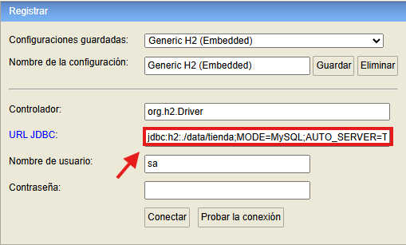

# Gestor-Tienda
## Instrucciones para h2

Para que funcione H2 en tu equipo primero debes ejecutar esto
`java -jar C:\Users\TU_USUARIO\.m2\repository\com\h2database\h2\2.2.224\h2-2.2.224.jar`

Despues en el navegador escribe esto:
`http://localhost:8082/`

Una vez dentro escribe esta ruta `jdbc:h2:./data/tienda;MODE=MySQL;AUTO_SERVER=TRUE` en URL JDBC

